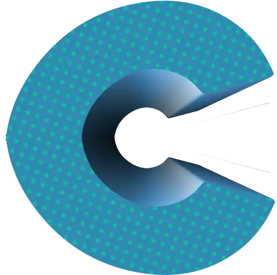

# cgossh

  

 

Self created coding challenge that shall use a C-based ssh client, to do
some arbitrary asynchronous operations, and a Go-based server side, to
handle those actions also asynchronously.  

---

Coding challenge: _I'll update here but for now the very simple goal is
something like: to create an array of ordered numbers and send it to
the server, and asynchronously handling those messages and store them._

---

#### Main focus topics of the challenge

**C (client) side**:

- Ring buffer library
- Semaphores
- Sorting algorithm
- Unit Testing
- SSH Client library

**Go (server) side**:

- Channels
- Go coroutines
- Using a ssh server library ([wish](https://github.com/charmbracelet/wish))
- Builtin unit testing

Maybe fun to add ideas:

- Bubbletea tui for the go-side
- Accessing some data or invoking some events from an API implemented in the go-side

#### TODO

- [x] Client setup of MacOS
  - [x] added unit testing with [criterion](https://github.com/Snaipe/Criterion)
  - [x] added [bear](https://github.com/rizsotto/Bear) instead of CMake
- [ ] Client setup for Ubuntu 18.04
- [ ] Server setup
  - [ ] Update/fix Makefile
